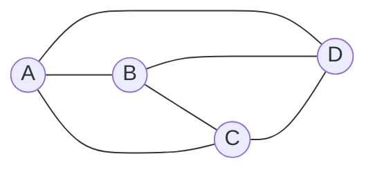
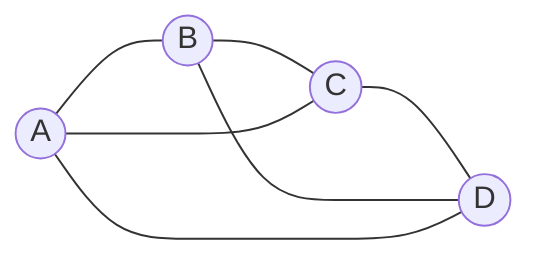
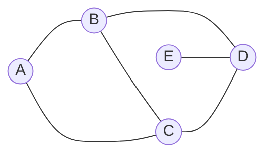
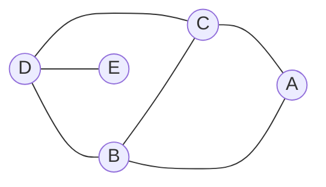
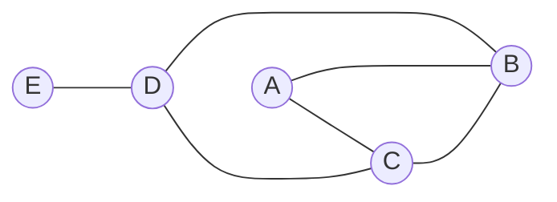

# Планарные и плоские графы

**Определение** *Планарный граф* - граф, который можно изобразить на плоскости без пересечений рёбер.

**Определение** *Плоский граф* - граф, который изображен на плоскости без пересечений рёбер. (планарный, вместе с изображением)

Плоский граф:

Планарный, но не плоский граф:

**Определение** *Грань* - это связная область, ограниченная рёбрами.

**Обозначение** $(V, E, F)$ - *плоская укладка* графа $G$, если $G$ - плоский граф и $F$ - множество граней.

## Изоморфизм графов

**Опрделение** Два графа $(V_1, E_1)$ и $(V_2, E_2)$ называются *изоморфными*, если существуют биекции $\phi: V_1 \to V_2$ и $\psi: E_1 \to E_2$ и они согласованы.

**Определение** Два плоских графа $(V_1, E_1, F_1)$ и $(V_2, E_2, F_2)$ называются *изоморфными*, если один можно получить из другого путём непрерывной деформации без разрывов и склеиваний.

$\updownarrow$ - изоморфны на плоскости и шаре

$\updownarrow$ - изоморфны на плоскости, но не на шаре

## Двойственность

**Определение** Даны два связных плоск$их графа $G_1 = (V_1, E_1, F_1)$ и $G_2 = (V_2, E_2, F_2)$ и есть биекции вершин $\phi: V_1 \to V_2$, рёбер $\psi: E_1 \to E_2$ и граней $\pi: F_1 \to F_2$, такие что они согласованы.
- $\phi$ и $\psi$ - изоморфны (также как и у обычных графов)
- $\pi$ - согласована с $\phi$ и $\psi$
**Замечание**
1. Бывает дополнительное условие, что внешняя грань укладки переходит во внешнюю грань укладки.
2. Порядок обхода граней может быть как по часовой стрелке, так и против часовой стрелки.

**Определение** $G = (V, E, F)$ - плоский граф. *Двойственность* определяется следующим образом:
- $V^*$ - множество точек в гранях (по одной точке на грань)
- $E^*$ - множество рёбер, соединяющих точки в гранях и пересекающих каждое ребро из $E$ ровно один раз
- $F^*$ - множество граней, образованных $E^*$  

**Утверждение** Пусть $G^* = (V^*, E^*, F^*)$ - двойственный граф к $G = (V, E, F)$.
Тогда $G^* \sim G$  

**Замечание** Если $G_1, G_2$ - два плоских графа, такие что $G_1 \sim G_2$ как планарные графы, то $G_1^*$ и  $G_2^*$ не обязательно изоморфны.

### Формула Эйлера

**Теорема** Пусть $G = (V, E, F)$ - связный плоский граф.  
Тогда $|V| - |E| + |F| = 2$ 

**Док-во** по индукции по $|F|$
$F = 1$ - очевидно
Переход: $|F| \geq 2 \Rightarrow$ есть две соседние грани $f_1$ и $f_2$  
$e$ - любое ребро между $f_1$ и $f_2$  
$G' = G \setminus e$  
$|V'| = |V|$  
$|E'| = |E| - 1$  
$|F'| = |F| - 1$  
$|V'| - |E'| + |F'| = |V| - |E| + |F| - 1 + 1 = |V| - |E| + |F| = 2$ 

**Док-во 2** 
Пусть $G = (V, E, F)$ - связный плоский граф.
$T \subset E$ - множество рёбер, которые образуют остовное дерево  
$|T| = |V| - 1$  
$G* = (F, E, V)$ - двойственный граф к $G$  
$E \setminus T$ - остовное дерево в $G*$  
Следовательно, $|E \setminus T| = |F| - 1$  
$|T| + |E \setminus T| = |V| + |F| - 2$

### Нижняя оценка числа рёбер в планарном графе

**Теорема** Дан простой планарный граф $G = (V, E, F)$, тогда $|E| \leq 3|V| - 6$ 
Если $G$ - двудольный, то $|E| \leq 2|V| - 4$  

**Док-во**  
Пусть $G = (V, E, F)$ - связный (благодаря добавлению рёбер) плоский граф.
$d$ - мнимальная длина грани  
$|V| - |E| + |F| = 2$ По формуле Эйлера  
$2|E| \geq d \cdot |F|$  
$2|E| = \sum$ длин граней $\geq d \cdot |F|$  
$2 = |V| - |E| + |F| \leq |V| - |E| + \frac{2|E|}{d}$  
$(1 - \frac{2}{d}) \cdot |E| \leq |V| - 2$  
$1 - \frac{2}{d} \leq 0 \Rightarrow$  
$|E| \leq (|V| - 2) \cdot \frac{d}{d - 2}$  
$|E| \leq (|V| - 2) \cdot \frac{3}{3 - 2} = (|V| - 2) \cdot 3 = 3|V| - 6$  
Если $G$ - двудольный, то $d$ - чётное $\Rightarrow$ $d \geq 4$  
$|E| \leq (|V| - 2) \cdot \frac{4}{4 - 2} = (|V| - 2) \cdot 2 = 2|V| - 4$  

**Следствие** Если $G$ - простой планарный граф, то есть вершина степени $\leq 5$  
**Док-во**  
Пусть не так, тогда есть вершина $v$ степени $\geq 6$  
$\Rightarrow 2|E| \geq 6|V| \Rightarrow |E| > 3|V| - 6$ - противоречие.  

**Следствие** Планарный граф без петель красится правильным образом в 6 цветов.  

**Следствие** $K_5$ и $K_{3,3}$ - непланарные графы.  
**Док-во**  
$v(K_5) = 5, e(K_5) = 10$  
$10 > 3 \cdot 5 - 6 = 9$  
$\Rightarrow K_5$ - непланарный граф. 
$K_{3,3}$ - двудольный граф  
$v(K_{3,3}) = 6, e(K_{3,3}) = 9$  
$9 > 2 \cdot 6 - 4 = 8$  
$\Rightarrow K_{3,3}$ - непланарный граф.  

## Гомеоморфизм графов

**Определение** Два графа $G_1 = (V_1, E_1, F_1)$ и $G_2 = (V_2, E_2, F_2)$ называются *гомеоморфными*, если в них можно разбить рёбра, так чтобы графы стали изоморфными.  

**Утверждение** Если $G_1$ и $G_2$ - гомеоморфные графы, то $G_1$ - планарный $\Leftrightarrow$ $G_2$ - планарный.  

### Теорема Понтрягина-Куратовского

**Теорема** $G$ - планарный граф $\Leftrightarrow$ $G$ не содержит подграфов, гомеоморфных $K_5$ или $K_{3,3}$.  

**Док-во ($\Rightarrow$)**  
Пусть не так, тогда есть подграф, гомеоморфный $K_5$ или $K_{3,3}$.  
Но $K_5$ и $K_{3,3}$ - непланарные графы, следовательно этот подграф не планарный, тогда и $G$ не планарный - противоречие.  

**Альтернативная формулировка (через миноры)** Нет минора $K_5$ и $K_{3,3}$.  

**Определение** Минор $K_5$ - 5 подграфов $A_i$, между каждыми двумя из которых есть ребро.