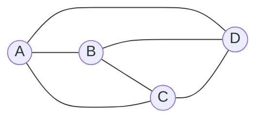
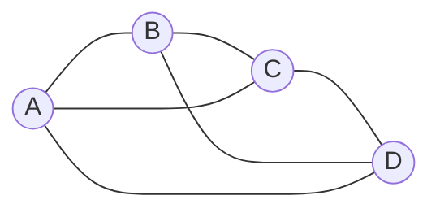
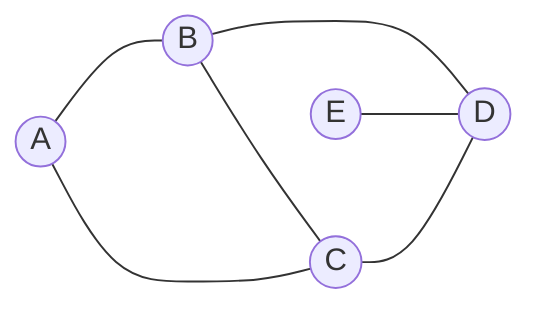
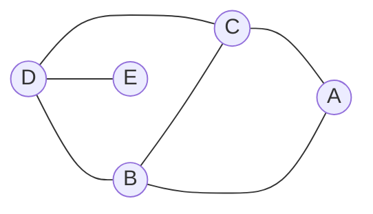
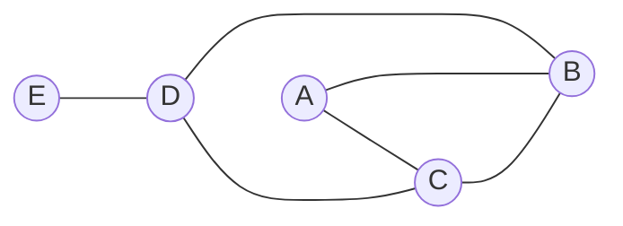

# Планарные и плоские графы

**Определение** *Планарный граф* - граф, который можно изобразить на плоскости без пересечений рёбер.

**Определение** *Плоский граф* - граф, который изображен на плоскости без пересечений рёбер. (планарный, вместе с изображением)

Плоский граф:

Планарный, но не плоский граф:

**Определение** *Грань* - это связная область, ограниченная рёбрами.

**Обозначение** $(V, E, F)$ - *плоская укладка* графа $G$, если $G$ - плоский граф и $F$ - множество граней.

## Изоморфизм графов

**Опрделение** Два графа $(V_1, E_1)$ и $(V_2, E_2)$ называются *изоморфными*, если существуют биекции $\phi: V_1 \to V_2$ и $\psi: E_1 \to E_2$ и они согласованы.

**Определение** Два плоских графа $(V_1, E_1, F_1)$ и $(V_2, E_2, F_2)$ называются *изоморфными*, если один можно получить из другого путём непрерывной деформации без разрывов и склеиваний.

$\updownarrow$ - изоморфны на плоскости и шаре

$\updownarrow$ - изоморфны на плоскости, но не на шаре

## Двойственность

**Определение** Даны два связных плоск$их графа $G_1 = (V_1, E_1, F_1)$ и $G_2 = (V_2, E_2, F_2)$ и есть биекции вершин $\phi: V_1 \to V_2$, рёбер $\psi: E_1 \to E_2$ и граней $\pi: F_1 \to F_2$, такие что они согласованы.
- $\phi$ и $\psi$ - изоморфны (также как и у обычных графов)
- $\pi$ - согласована с $\phi$ и $\psi$
**Замечание**
1. Бывает дополнительное условие, что внешняя грань укладки переходит во внешнюю грань укладки.
2. Порядок обхода граней может быть как по часовой стрелке, так и против часовой стрелки.

**Определение** $G = (V, E, F)$ - плоский граф. *Двойственность* определяется следующим образом:
- $V^*$ - множество точек в гранях (по одной точке на грань)
- $E^*$ - множество рёбер, соединяющих точки в гранях и пересекающих каждое ребро из $E$ ровно один раз
- $F^*$ - множество граней, образованных $E^*$  

**Утверждение** Пусть $G^* = (V^*, E^*, F^*)$ - двойственный граф к $G = (V, E, F)$.
Тогда $G^* \sim G$  

**Замечание** Если $G_1, G_2$ - два плоских графа, такие что $G_1 \sim G_2$ как планарные графы, то $G_1^*$ и  $G_2^*$ не обязательно изоморфны.

### Формула Эйлера

**Теорема** Пусть $G = (V, E, F)$ - связный плоский граф.  
Тогда $|V| - |E| + |F| = 2$ 

**Док-во** по индукции по $|F|$
$F = 1$ - очевидно
Переход: $|F| \geq 2 \Rightarrow$ есть две соседние грани $f_1$ и $f_2$  
$e$ - любое ребро между $f_1$ и $f_2$  
$G' = G \setminus e$  
$|V'| = |V|$  
$|E'| = |E| - 1$  
$|F'| = |F| - 1$  
$|V'| - |E'| + |F'| = |V| - |E| + |F| - 1 + 1 = |V| - |E| + |F| = 2$ 

**Док-во 2** 
Пусть $G = (V, E, F)$ - связный плоский граф.
$T \subset E$ - множество рёбер, которые образуют остовное дерево  
$|T| = |V| - 1$  
$G* = (F, E, V)$ - двойственный граф к $G$  
$E \setminus T$ - остовное дерево в $G*$  
Следовательно, $|E \setminus T| = |F| - 1$  
$|T| + |E \setminus T| = |V| + |F| - 2$

### Нижняя оценка числа рёбер в планарном графе

**Теорема** Дан простой планарный граф $G = (V, E, F)$, тогда $|E| \leq 3|V| - 6$ 
Если $G$ - двудольный, то $|E| \leq 2|V| - 4$  

**Док-во**  
Пусть $G = (V, E, F)$ - связный (благодаря добавлению рёбер) плоский граф.
$d$ - мнимальная длина грани  
$|V| - |E| + |F| = 2$ По формуле Эйлера  
$2|E| \geq d \cdot |F|$  
$2|E| = \sum$ длин граней $\geq d \cdot |F|$  
$2 = |V| - |E| + |F| \leq |V| - |E| + \frac{2|E|}{d}$  
$(1 - \frac{2}{d}) \cdot |E| \leq |V| - 2$  
$1 - \frac{2}{d} \leq 0 \Rightarrow$  
$|E| \leq (|V| - 2) \cdot \frac{d}{d - 2}$  
$|E| \leq (|V| - 2) \cdot \frac{3}{3 - 2} = (|V| - 2) \cdot 3 = 3|V| - 6$  
Если $G$ - двудольный, то $d$ - чётное $\Rightarrow$ $d \geq 4$  
$|E| \leq (|V| - 2) \cdot \frac{4}{4 - 2} = (|V| - 2) \cdot 2 = 2|V| - 4$  

**Следствие** Если $G$ - простой планарный граф, то есть вершина степени $\leq 5$  
**Док-во**  
Пусть не так, тогда есть вершина $v$ степени $\geq 6$  
$\Rightarrow 2|E| \geq 6|V| \Rightarrow |E| > 3|V| - 6$ - противоречие.  

**Следствие** Планарный граф без петель красится правильным образом в 6 цветов.  

**Следствие** $K_5$ и $K_{3,3}$ - непланарные графы.  
**Док-во**  
$v(K_5) = 5, e(K_5) = 10$  
$10 > 3 \cdot 5 - 6 = 9$  
$\Rightarrow K_5$ - непланарный граф. 
$K_{3,3}$ - двудольный граф  
$v(K_{3,3}) = 6, e(K_{3,3}) = 9$  
$9 > 2 \cdot 6 - 4 = 8$  
$\Rightarrow K_{3,3}$ - непланарный граф.  

## Гомеоморфизм графов

**Определение** Два графа $G_1 = (V_1, E_1, F_1)$ и $G_2 = (V_2, E_2, F_2)$ называются *гомеоморфными*, если в них можно разбить рёбра, так чтобы графы стали изоморфными.  

**Утверждение** Если $G_1$ и $G_2$ - гомеоморфные графы, то $G_1$ - планарный $\Leftrightarrow$ $G_2$ - планарный.  

### Теорема Понтрягина-Куратовского

**Теорема** $G$ - планарный граф $\Leftrightarrow$ $G$ не содержит подграфов, гомеоморфных $K_5$ или $K_{3,3}$.  

**Док-во ($\Rightarrow$)**  
Пусть не так, тогда есть подграф, гомеоморфный $K_5$ или $K_{3,3}$.  
Но $K_5$ и $K_{3,3}$ - непланарные графы, следовательно этот подграф не планарный, тогда и $G$ не планарный - противоречие.  

**Альтернативная формулировка (через миноры)** Нет минора $K_5$ и $K_{3,3}$.  

**Определение** Минор $K_5$ - 5 подграфов $A_i$, между каждыми двумя из которых есть ребро.  

### Теорема Фари  
**Теорема** Любой простой плоский граф можно выпрямить, т.е.  
$G$ - простой плоский граф $\Rightarrow$ $\exists G' : G \sim G' \land$ в $G'$ все рёбра отрезки. 
Т.е. не будет дуг  
**Доказательство** Индукция по количеству вершин  
База: $|V| \leq 3$ - очевидно  
Переход: $G$ - плоский  
**Лемма** Добавим в $G$ рёбра так, чтобы $\tilde{G}$ остался простым и все грани были треугольниками  
  **Доказательство**  
  Пусть есть не треугольная грань, значит мы можем добавить ребро между какими-то двумя вершинами этой грани, не нарушая условий $\tilde{G}$.  
$\Rightarrow$ $\tilde{G}$ - простой граф, все грани которого треугольники.  
Если у нас $n$ вершин, то у нас $3n - 2$ рёбер.  
$2|E| = 3|F| \Rightarrow |F| = \frac{2|E|}{3}$
$2 = n - |E| + |F|$  
$|F| = n - \frac{|E|}{3}$  
степени вершин внешней грани $\geq 3$  
сумма степеней вершин $= 2|E| = 6(n-2)$  
сумма степеней внутренних вершин $\leq 6(n-2) - 9 = 6(n-3) - 3$  
$\Rightarrow$ есть внутренняя вершина степени $\leq 5$  
Рассмотрим эту вершину $v$ степени $\leq 5$  
1. Пусть $\deg(v) = 3$  
  $\tilde{G} \setminus v$ выпрямляется (по ИП)  
  Получаем $(\tilde{G} \setminus v)' + v$ - выпрямляется  
2. Пусть $\deg(v) = 4$  
  $\tilde{G} \setminus v$ выпрямляется (по ИП)  
  Как и в выпуклый, так и невыпуклый четырёхугольник можно добавить $v$, соединённое отрезками со всеми его вершины.  
3. Пусть $\deg(v) = 5$  
  **Утверждение** Существует $i \in \{1, 2, 3, 4, 5\}$ такое что в $\tilde{G}$ нет обоих рёбер $(a_{i-2}, a_i)$ и $(a_i, a_{i+2})$  
  Иначе точно существует пересечение рёбер.  
  НУО предположим, что $a_1a_3$ и $a_5a_3$ не существуют в $\tilde{G}$.  
  $\tilde{G} \setminus v$ выпрямляется (по ИП)  
  Получаем $G' = (\tilde{G} \setminus v) + a_1a_3 + a_5a_3$ - выпрямляется (добавленные рёбра внутри)  
  $\Rightarrow$ есть выпрямленный граф изоморфный $G'$  
  **Лемма** Cуществует луч в $\Delta a_1a_3a_5$ такой, что образуемые им углы $< \Pi$  
    назовём эти углы $\alpha, \beta$  
    $\alpha + \beta < 2\Pi$  
    $\Rightarrow$ $\exists \alpha, \beta : \alpha < \Pi \land \beta < \Pi$  
  Значит можно добавить $v$, на этом луче, соединённое отрезками со всеми его вершинами.  
  Получаем $(\tilde{G} \setminus v)' + v$ - выпрямляется  

### Теоремы, похожие на теорему Фари

**Теорема** $G$ - простой плоский граф  
$\Rightarrow$ Можно нарисовать такую картину из монеток, так что две монетки касаются тогда и только тогда, когда существует ребро между соответствующими вершинами.  

# Расскраски графов  

### Определения

дан граф $G$  
*Правильной расскраской* графа в $n$ цветов называется отображение $c : V(G) \to \{1, 2, \ldots, n\}$ такое, что $\forall e \in E(G) : c(u) \neq c(v)$  
*Хроматическое число* графа - это минимальное $n$, такое что $\exists$ правильная расскраска в $n$ цветов.  
Обозначается $\сhi(G)$  

### Теорема о 4 красках
**Теорема** Если $G$ - планарный без петель, то $\chi(G) \leq 4$  
**Замечание** В оригинальной формулировке гипотезы красили области, что соответствует двойственному графу.  
**Замечание** Есть планарные графы, у которых $\chi(G) = 4$ - например, $K_4$  
**Док-во** что у плоского без петель $\chi(G) \leq 5$ по индукции по количеству вершин  
База: $|V| \leq 5$ - очевидно  
Переход: $G$ - плоский без петель  
$G'$ - простой плоский (удалим кратные рёбра)  
$\tilde{G}$ - триангуляция $G'$  
в $\tilde{G}$ есть вершина степени $\leq 5$  
НУО предположим, что $\deg(v) \geq 6$  
1. Пусть $\deg(v) = 4$  
  покрасим по ИП $\tilde{G} \setminus v$ в 5 цветов  
  значит есть цвет, который не используется для соседних вершин  
  покрасим $v$ в этот цвет  
  получили правильную расскраску в 5 цветов  
2. Пусть $\deg(v) = 5$  
  Пусть ребра $a_1, a_3 \not\in \tilde{G}$  
  Возьмём $(\tilde{G} \setminus v)$ и склеим в одну вершину $a_1a_3$  
  Получим плоский граф без петель $\Rightarrow$ по ИП можно раскрасить в 5 цветов  
  Значит $(\tilde{G} \setminus v)$ красится в 5 цветов, так чтобы $a_1$ и $a_3$ были одного цвета  
  Покрасим $v$ в цвет, который не используется для соседних вершин  
  получили правильную расскраску в 5 цветов  

## Теоремы на поверхностях рода $g$

$g$ - род поверхности  
$g = 0$ - сфера  
$g = 1$ - тор  
$\vdots$  

**Определение** Мы говорим, что граф можно нарисовать на поверхности рода $g$, если это можно сделать без пересечений рёбер.  

На плоскости
$$|V| - |E| + |F| = 2$$
На поверхности рода $g$
$$|V| - |E| + |F| = 2 - 2g$$
Идея доказательства по индукции по количеству вершин  

### Теорема Хивуда

**Теорема** Если граф можно нарисовать на поверхности рода $g \geq 1$, то $\chi(G) \leq \frac{7 + \sqrt{1 + 48g}}{2}$  
**Замечание** для $g = 0$ это частный случай теоремы о 4 красках  
**Док-во**  
Пусть не так, тогда $G$ - минимальный контр пример для рода $g$  
Триангулируем $G$  
$d = \frac{7 + \sqrt{1 + 48g}}{2}$  
Если есть вершина степени $< d$, то это не минимальный контр пример $\Rightarrow$ все степени вершин $\geq d$  
$|V| \geq d + 1$  
$|F| = \frac{2|E|}{3}$  
$|V| - \frac{|E|}{3} = 2 - 2g$  
$2|E| \geq d|V|$  
$|V| - \frac{|E|}{3} \leq |V| - \frac{d|V|}{6}$  
$6|V| - d|V| \geq 6(2 - 2g)$  
$|V|(6 - d) \geq 6(2 - 2g)$  
$(6 - d) \leq 0$  
$|V|(d - 6) \leq 6(2g - 2)$  
$|V|(d - 6) \geq (d+1)(d - 6)$  
$d^2 - 5d - 6 \leq 12g - 12$  
$d^2 - 5d + 6 - 12g \leq 0$  
корни $\frac{5 \pm \sqrt{1 + 48g}}{2}$  
$g \in [\frac{5 - \sqrt{1 + 48g}}{2}, \frac{5 + \sqrt{1 + 48g}}{2}]$  
$\Rightarrow d \leq \frac{5 + \sqrt{1 + 48g}}{2}$ - противоречие 
 

### Теорема Рингеля-Янгса

**Теорема** На поверхности рода $g$ $\exists$ граф с $\chi(G) = \left\lceil \frac{7 + \sqrt{1 + 48g}}{2} \right\rceil$  
**Замечание**  
для $g = 0$  
  оценка сложно  (теорема о 4 красках)
  пример легко  (K_4)  
для $g \geq 1$  
  оценка легко (теорема Хивуда)
  пример сложно (теорема Рингеля-Янгса)

### Теорема Брукса  

**Теорема** Пусть $G$ - связный простой граф, такой что максимальная степень вершины $\leq d$ и граф не изоморфен $K_{d+1}$  
Тогда для $d \geq 3$ $\chi(G) \leq d$  
**Замечание** Для $d = 2$ 
`пятиугольник`  
**Док-во** по индукции по количеству вершин  
База: $|V| \leq d$ - очевидно  
Переход: $|V| \geq d + 1$  
**Утверждение** Есть 3 вершины $u, v, w$ такие что $uw \in E, vw \in E, uv \not\in E$  
  Пусть не так, значит граф полный, т.е. изоморфен $K_{d+1}$ - противоречие.  
Рассмотрим граф $\tilde{G}$ - граф $G$ где склеили вершины $u$ и $v$ в одну вершину $\uv$  
**Лемма** Пусть $H$ - граф, $\deg(x) \leq c$  
  $\chi(H) \leq c \Leftrightarrow \chi{H \setminus x} \leq c$  
Мы хотим покрасить $\tilde{G}$ в $d$ цветов  
$\deg_{\tilde{G}}(w) = \deg_G(w) - 1 < d$  
удаляем вершины степени $< d$, пока они есть  
1. Удалили все $\Rightarrow$ $\tilde{G}$ красится в $d$ цветов $\Rightarrow G$ красится в $d$ цветов  
2. Не всё удалили  
  $V_1$ - вершины, которые остались  
  $uv \in V_2$ - вершины, которые остались  
  Вернёмся к $G$  
  Есть хотя бы одно ребро из $u$ в $V_2$ и хотя бы одно ребро из $v$ в $V_2$  
  $G_1 = G |_{V_1 \cup \{\uv\}} + uv$  
  $G_2 = G |_{V_2 \cup \{\uv\}} + uv$  
  $\chi(G + uv) = \max(\chi(G_1), \chi(G_2))$  
  Максимальная степень вершины в $G_1$ $\leq d$  
  Максимальная степень вершины в $G_2$ $\leq d$  
  если $\chi(G_1), \chi(G_2) \leq d$, то $\chi(G) \leq d$  
  остался случай, когда $\chi(G_1) = d+1 или $\chi(G_2) = d+1$  
  $\Rightarrow$ $G_1 = K_{d+1}$ или $G_2 = K_{d+1}$  

**Определение** *Хроматический многочлен* графа $G$ - это функция $\chi_G : \mathbb{N} \to \mathbb{Z}$ такоя, что $\chi_G(n)$ - это количество правильных расскрасок графа $G$ в $n$ цветов.  

**Утверждение** $\chi_G(n)$ - многочлен  

**Теорема** $\chi_G(n) = \underset{k \in \mathbb{N}}{\sum} \underset{A_1, A_2, \ldots, A_k}{\sum C_n^k}, A_1, \ldots, A_k$ - не пустные, не пересекающиеся подмножества $V(G)$, такие что $\underset{i=1}{\overset{k}{\bigcup}} A_i = V(G)$, внутри $A_i$ нет рёбер  
**Следовательно** $\chi_G(n)$ - многочлен, т.к. 
$\chi_G(n) = \underset{k = 1}{\overset{|V|}} c_k \cdot C_n^k$, где $c_k$ - это количество разбиений $V(G)$ на $k$ непустых, не пересекающихся подмножеств(количество раскрасок ровно в $k$ цветов).  

$e \in E(G)$ - не петля  
$G - e = G \setminus e$ - граф, с удаленным ребром $e$  
$G \cdot e = G / e$ - граф, склеенными концами ребра $e$  

**Теорема** $\chi_G(n) = \chi_{G - e}(n) - \chi_{G \cdot e}(n)$  
**Следствие** $\chi_G(n)$ - многочлен  

**Теорема** $G$ - простой граф, тогда:  
- $\deg(\chi_G(n)) = |V|$  
  индукция по количеству рёбер  
- старший коэффициент $\chi_G(n)$ равен 1  
- в $\chi_G(n)$ знаки коэффициентов чередуются  
- коэффициент при $n^{|V|-1}$ равен $-|E|$  
- кратность корня $0$ в $\chi_G(n)$ равна количеству компонент связности графа $G$  
**Док-во**  
Пусть $v = |V| = |V(G)|$  
- Хотим доказать: $\chi_G(n) = n^v - a_1 \cdot n^{v-1} + a_2 \cdot n^{v-2} - a_3 \cdot n^{v-3} + \ldots$  
  $a_i \in \mathbb{Z}_{\geq 0}$  
  Док-во по индукции по $|E|$  
  База: $|E| = 0$ - очев  
  $\chi_{G - e}(n) = x^v - b_1 \cdot x^{v-1} + b_2 \cdot x^{v-2} - b_3 \cdot x^{v-3} + \ldots$  
  $\chi_{G \cdot e}(n) = x^{v-1} - c_1 \cdot x^{v-2} + c_2 \cdot x^{v - 3} - \ldots$  
  $b_i, c_i \in \mathbb{Z}_{\geq 0}$ по ИП.  
  $a_1 = b_1 + 1$  
  $a_i = b_i + c_{i - 1} \feq 0$  
$\Rightarrow a_1 = |E|$  
**Утверждение** $G$ - связный, $C_1, C_2, C_3, \ldot, C_k$ - его компонент связности  
Тогда $\chi_G(n) = \chi_{C_1}(n) \cdot \ldots \cdot \chi_{C_k}(n)$  
**Следствие** $\chi_G(n) \vdots n^{\x\text{компонент связностей}}$  
**Лемма** $G$ - связный простой граф  
Тогда $\chi_g(n) \vdots n, \chi_G(n) \not\vdots n^2$  
**Док-во** по индукции по $|E|$  
$a_{v-1} = b_{v - 1} + c_{v - 1}$  
$G - e$ - связный $\Rightarrow b_{v-1} \neq 0 \Rightarrow a_{v - 1} \neq 0$  
$G - e$ - несвязный $\Rightarrow G \cdot e$ - простой связный $\Rightarrow c_{v - 2} \neq 0$  

**Определение** Последовательность $\z_1, z_2, \ldots z_M \in \mathbb{Z}_{\geq 0}$  
- называется *унимодальной*, если $\exists 1 \leq k \leq M : z_1 \leq z_2 \leq \ldots \leq z_k \land z_k \geq \z_{k + 1} \geq \ldots \geq z_m$  
- называется *лог-вогнутая*, если $\forall 2 \leq k \leq M - 1 : z_{k-1} \cdot z_{k+1} \leq z_k^2$  

**Утверждени** Лог-вогнутая $\Rightarrow$ унимодальная  

**Теорема** $a_0 (= 1), a_1, a_2, a_3, \ldots$ - лог-вогнутая последовательность  
Доказано: Jone Huh в 2012  
